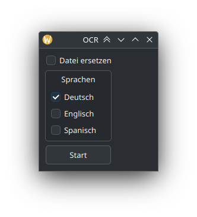

# dolphin_ocr
OCR context menu option for the Dolphin file manager.
## Prerequisites
Please make sure you have the following packages installed:
```
python (version 3)
python-pyqt6
tesseract (OCR)
tesseract-data-eng (English OCR data)
tesseract-data-deu (German OCR data)
tesseract-data-spa (Spanish OCR data)
```

## Install
1. Copy the file `dolphin_ocr.desktop` to `/usr/share/kio/servicemenus/`
```shell
sudo cp dolphin_ocr.desktop /usr/share/kio/servicemenus/
```
2. Copy the file `dolphin_ocr` to `/usr/bin/`
```shell
sudo cp dolphin_ocr /usr/bin/
```
3. Open Dolphin and right-click on a pdf. This window should open:


Note: After clicking start, the window will hang while OCR is running and close itself after success.